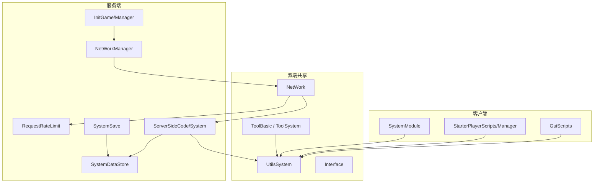

# Roblox 开发规范

本文档定义团队 Roblox/Luau 项目的架构分层、模块加载、模块设计、通信、数据持久化、命名、编码与性能规范，旨在提高代码可读性、可维护性与安全性。

> 框架使用细节可参考 `src/ReplicatedFirst/AllSideCode/ReadMe.legacy.luau`；本文档侧重**必须遵守的规范**。文本本地化见 [文本本地化开发规范](./文本本地化开发规范.md)。

---

## 目录

1. [架构分层规范](#一架构分层规范)
2. [UtilsSystem 与模块加载规范](#二utilsystem-与模块加载规范)
3. [模块设计规范](#三模块设计规范)
4. [事件通信与驱动规范](#四事件通信与驱动规范)
5. [数据持久化设计规范](#五数据持久化设计规范)
6. [命名规范](#六命名规范)
7. [代码编写规范](#七代码编写规范)
8. [性能规范](#八性能规范)

---

## 一、架构分层规范

### 1.1 完整目录地图

代码按运行端、加载时机与职责分层放置，**禁止跨层写入不属该层的逻辑**。

```
ReplicatedFirst/
└── AllSideCode/                    # 双端共享，游戏启动最先加载
    ├── UtilsSystem.luau            # 统一模块访问入口
    ├── Interface/                  # 类型定义（*-Type.luau）
    ├── ToolBasic/                  # 基础工具（无业务状态）
    ├── ToolSystem/                 # 业务工具（CfgFind、UIMgr 等）
    └── Class/                      # 可实例化类模块

ReplicatedStorage/
├── Msg/                            # 通信对象（Event / RemoteEvent / RemoteFunction / Function）
└── ClientSideCode/
    ├── SystemModule/               # 客户端系统（双端可 require）
    ├── GuiScripts/                 # UI 脚本与 UI 模块
    └── Tool/                       # 第三方或客户端工具

ServerStorage/
└── ServerSideCode/
    └── System/                     # 服务端业务 System 模块

ServerScriptService/
└── InitGame/
    └── Manager/                    # 服务端启动与事件路由（*.server.luau）

StarterPlayer/
├── StarterPlayerScripts/
│   └── Manager/                    # 客户端启动与生命周期编排
└── StarterCharacterScripts/        # 角色级逻辑（动画、镜头等）
```

### 1.2 各层职责与禁止项

| 目录 | 用途 | 禁止写入 |
|------|------|----------|
| `AllSideCode` | 双端共享工具、类型、UtilsSystem | 服务端权威业务逻辑、UI 渲染 |
| `AllSideCode/ToolBasic` | 纯工具函数库 | 业务状态、存档读写 |
| `AllSideCode/ToolSystem` | 双端业务工具 | 服务端权威状态修改 |
| `ServerSideCode/System` | 服务端权威业务逻辑 | 客户端 UI / 渲染代码 |
| `ClientSideCode/SystemModule` | 客户端系统（可双端读取） | 玩家存档、服务端权威状态 |
| `ClientSideCode/GuiScripts` | UI 展示与输入 | 直接修改服务端权威数据 |
| `InitGame/Manager` | 启动编排、事件路由 | 复杂业务逻辑、直接 DataStore |
| `StarterPlayerScripts/Manager` | 客户端启动、绑事件 | 复杂业务逻辑 |
| `ReplicatedStorage/Msg` | 通信对象实例 | 业务逻辑脚本 |

### 1.3 Manager 与 System 职责边界

| 层级 | 职责 | 允许 | 禁止 |
|------|------|------|------|
| **Manager** | 薄编排层：启动、绑事件、路由到 System | 调用已缓存的 System 模块（如 `SystemBag`）、频率检查、日志 | 复杂业务、直接 `DataStore`、大段数据处理 |
| **System** | 领域业务：数据变更、规则校验 | 读写会话数据、经 `SystemDataStore` 持久化、调用其他 System 接口 | 直接使用 `DataStoreService`、私自监听 Remote |
| **ServerStateSync** | 服务端将 Store / 会话数据同步到 workspace 镜像（如全局数值、BUFF、排行榜缓存） | 经 `SystemDataStore` 读取后写 workspace Instance | 修改玩家会话、直接 `DataStoreService` |
| **GuiScripts** | 展示、输入、发 Remote | 读本地缓存 / workspace 镜像、调 UI 工具 | 伪造或本地修改服务端权威数据 |

**示例：** `NetWork`（ToolSystem）负责 Remote 监听分发与 `RequestRateLimit` 中间件；`NetWorkManager` 仅启动管道；具体背包逻辑由 `SystemBag` 处理。

### 1.4 双端逻辑拆分原则

- 同一业务如需双端实现，应拆成 **Server System** / **Client SystemModule**（或 GuiScripts）两个独立模块。
- **业务 System 模块禁止**用 `IsServer` 分支承载两套业务逻辑。
- **允许**在 `AllSideCode` 基础设施（如 `UtilsSystem`）中按端分流，但仅限于**模块加载与路由**，不写具体业务。

```lua
-- ✅ 允许：基础设施按端加载
if IsServer then
    return LoadServerSystemModule(key)
end

-- ❌ 禁止：业务模块内混写双端逻辑
function SystemBag.DoSomething()
    if RunService:IsServer() then
        -- 服务端逻辑
    else
        -- 客户端逻辑
    end
end
```

### 1.5 架构总览



### 1.6 权威边界：禁止客户端权威结算（P0）

**原则：** 客户端不可信。任何会影响进度、经济、胜负、掉落、伤害结果的状态，**权威只在服务端**。发现或被要求实现「客户端权威结算」时，必须 **严正警告开发者（P0）并拒绝按该方案落地**，改为服务端权威 + 客户端预测/表现。

「客户端权威」指：以客户端上报或本地计算结果作为最终事实，服务端照单记账或不校验。**不是**「代码跑在客户端」。

| 领域 | 禁止（客户端权威） | 正确 |
|------|-------------------|------|
| 经济 / 背包 | 客上报获得金币、物品，服直接发奖 | 服根据击杀、任务、商店规则发奖 |
| 伤害 / 命中 | 客 Hitbox / `GetPartsInPart` 定伤、定击杀 | 服 `HitResolver` / 逻辑体 OBB |
| 进度 | 客上报任务完成、关卡通关 | 服校验条件后改存档 |
| 刷怪 / 掉落 | 客请求生成并自定掉落 | 服 Spawn + 配表掉落 |
| 位移兑现奖励 | 客上报位置，服按该位置给宝箱 / 区域奖励 | 服自有位置权威或包络校验后再结算 |

**允许且不视为客户端权威（勿误报）：**

- 表现：插值、动画、FX、UI
- 输入预测：技能预表现、软合并；**结算以服为准**
- 玩家角色物理：Roblox 默认 `NetworkOwnership` 在客户端，必须配服务端观测 / 包络（如 `SystemCharacterMotion`）；**禁止把客上报 `CFrame` 当作发奖或命中依据**
- 已文档化的例外须写明：预测范围、服如何纠偏、失败时以谁为准

**禁止用「本地测试方便」「先这样后面再改」绕过。** 未加服校验的客侧发奖会直接变成刷资源。

### 1.7 单一写口：禁止多源头抢写位姿等权威状态（P0）

**原则：** 同一实体的同一权威字段（尤其是位置 / 朝向 / 速度），同一时刻只能有 **一个写口**；多个意图必须经 **已文档化的合成器或仲裁器** 合成后再写入。发现逻辑不明确的多源头同时（或交替覆盖）设置位置等，必须 **严正警告（P0）**，不得继续叠加写口。

「同时」包含：同帧竞争、未声明优先级的交替覆盖、双端各自当权威回写。结果若依赖 Heartbeat / 网络包到达顺序，即为抢写。

| 典型抢写（禁止） | 正确路径 |
|------------------|----------|
| AI、击退、冲刺、坐骑、同步包、技能 Action 各自 `PivotTo` / 写 `CFrame` / `AssemblyLinearVelocity` / `Humanoid:Move` / `Store.setCFrame` | 接入已有唯一写口或命令队列 |
| 再开一套 Heartbeat / `BodyVelocity` 与现有电机并行 | 玩家平面速度只经 `CharacterMotion` `Compose(Drive+Impulse)` |
| 客户端 LocalMonster / 插值结果回写逻辑怪权威位姿 | 逻辑怪位姿只经 `LogicEntityMotion` / `EnemySim` 写 Store；客机只插值 |
| 多脚本直写 `Humanoid.WalkSpeed` / 冻腿 | `LockMovement` / `ActionArbiter` / `PushLock` |

**允许（不是抢写）：**

- 合成器内部多输入（Drive + Impulse）——对外仍是单写口
- 表现层跟随权威（插值），不回写权威
- 硬切场景传送：由唯一权威模块执行，并打断进行中的位移会话

新增位移需求必须先回答：谁是当前写口、如何互斥或合成、被打断时谁清状态。答不清则不得开工。

### 1.8 开工门禁：方案二次审评通过后才能写业务代码（P0）

**原则：** 方案初稿不等于可开工。制定完方案后必须再做 **一轮对照规范的二次审评**，结论为通过（或有条件通过且条件已写回方案），并经需求提出方明确同意后，才能改业务代码。禁止「方案一出立刻开工」或「边写边审算通过」。

二次审评可以与初稿作者为同一人（含 Agent），但必须 **单独出具结论**，不得用初稿自我背书。审评对照至少包括：§1.2–1.4 分层、§1.6 权威结算、§1.7 单一写口、Remote / 存档路径、未决问题。

| 结论 | 含义 | 可否开工 |
|------|------|----------|
| **通过** | 无 P0；方案写清权威方、写口、分层 | 需求提出方同意后可以 |
| **有条件通过** | 无 P0；P1 已写回方案为约束 | 按修订后方案，同意后可以 |
| **不通过** | 仍有 P0（客机结算、抢写、分层错误、权威/写口答不清） | **禁止开工**；改方案后再审 |

**必须走门禁（非穷尽）：** 新 System / 新远程协议、战斗与位移、经济与掉落、存档字段、跨 3 个以上模块、会碰到 §1.6 或 §1.7 的改动。

**可免二次审评：** 错字与注释、不改行为的格式、单一文件且不触及权威/写口/Remote/存档的机械修复。有疑点时按必须走门禁处理。

**禁止：** 用「先写一版再看」「本地测试方便」跳过；Agent 在同一轮里既出初稿又开始改业务代码。紧急跳过须需求提出方 **明示**，并记录仍敞口的 §1.6 / §1.7 风险。

---

## 二、UtilsSystem 与模块加载规范

`UtilsSystem` 是框架统一模块访问入口，所有业务代码**必须优先通过它**访问模块与通信对象。

### 2.1 基本用法

```lua
local Utils = require(game.ReplicatedFirst.AllSideCode.UtilsSystem)

-- Services：立即可用
local Players = Utils.Players

-- 模块：延迟加载（首次访问时 require 并缓存）
local Log = Utils.Log
local SystemBag = Utils.SystemBag  -- 仅服务端可用

-- 通信对象：通过 Utils 访问，禁止硬编码路径
local showLocalUI = Utils.RemoteEvent.ShowLocalUI
local serverEvent = Utils.Event.EventName
```

### 2.2 模块注册位置

| 模块类型 | 物理路径 | 访问方式 |
|----------|----------|----------|
| 基础工具 | `AllSideCode/ToolBasic/` | `Utils.Log`、`Utils.MathMgr` 等 |
| 业务工具 | `AllSideCode/ToolSystem/` | `Utils.CfgFind`、`Utils.UIMgr` 等 |
| 服务端 System | `ServerSideCode/System/` | `Utils.SystemBag`（仅服务端） |
| 客户端 System | `ClientSideCode/SystemModule/` | `Utils.DataCache`（双端可用） |
| 通信对象 | `ReplicatedStorage/Msg/` | `Utils.RemoteEvent.*`、`Utils.Event.*` 等 |

新建模块时，**文件名必须与 `Utils` 访问键名一致**（如 `SystemBag.luau` → `Utils.SystemBag`）。

### 2.3 顶部缓存与短名调用

通过 `UtilsSystem` 获取的**模块、服务、通信对象**，必须在文件顶部「模块引用」区块一次性 `local` 缓存，后续全文使用短名调用。

**禁止**在模块级初始化、函数体或业务逻辑中反复写 `Utils.XXX` 链式访问。

```lua
-- ✅ 正确：顶部缓存，短名调用
local Utils = require(game.ReplicatedFirst.AllSideCode.UtilsSystem)
local Log = Utils.Log
local SystemGameConfig = Utils.SystemGameConfig
local CfgFind = Utils.CfgFind

local maxWeekID = SystemGameConfig.GetValue({ "每日签到", "每日签到最大多少轮次" })
Log.print("loaded", maxWeekID)

-- ❌ 错误：长链式引用
local maxWeekID = Utils.SystemGameConfig.GetValue({ "每日签到", "每日签到最大多少轮次" })

-- ❌ 错误：函数内反复 Utils 访问
function foo()
	Utils.Log.print("...")
end
```

| 场景 | 做法 |
|------|------|
| 首次 require | `local Utils = require(...UtilsSystem)`，紧随模块引用区块 |
| 用到的 Utils 键 | 各写一行 `local X = Utils.X`（含 `Players`、`RemoteEvent.*` 等） |
| 后续调用 | 仅用短名：`Log.print(...)`、`SystemGameConfig.GetValue(...)` |
| 打破循环引用 | 允许在函数内延迟 `Utils` 访问（见 [2.6](#26-循环引用处理)），但仍须优先重构依赖 |

### 2.4 require 规则

| 场景 | 做法 |
|------|------|
| 业务模块访问其他模块 | 顶部 `local X = Utils.X`，全文短名调用（见 [2.3](#23-顶部缓存与短名调用)） |
| 同目录子模块 | `require(script.SaveMetaData)`（允许） |
| 防循环引用 | 检测到循环时可用直接路径 `require`（见 UtilsSystem 注释） |
| 跨层长路径 require | **禁止** `require(game.ServerStorage...)` 绕过 UtilsSystem |

```lua
-- ✅ 正确
local Utils = require(game.ReplicatedFirst.AllSideCode.UtilsSystem)
local SystemBag = Utils.SystemBag

-- ✅ 正确：同目录子模块
local SaveMetaData = require(script.SaveMetaData)

-- ❌ 错误：绕过 UtilsSystem
local SystemBag = require(game.ServerStorage.ServerSideCode.System.SystemBag)
```

### 2.5 非延迟加载白名单

部分**纯数据/常量**独立模块可在 `UtilsSystem` 的 `EAGER_LOAD_WHITELIST` 中登记，启动时即 `require`，无需首次访问触发。

| 模块 | 路径 | 说明 |
|------|------|------|
| `NetMsg` | `ToolBasic/NetMsg` | 通信 msgName 常量表 |
| `EnumMgr` | `ToolSystem/EnumMgr` | 枚举常量表 |

**准入条件（全部满足才可加入白名单）：**

1. 纯数据/常量表，无 `require` 其他 Utils 模块
2. 无副作用：无 `Init`、无事件绑定、无端侧分支逻辑
3. 无循环引用风险

新增白名单条目须经框架评审，在 `UtilsSystem.luau` 的 `EAGER_LOAD_WHITELIST` 中按 `{ scope, name }` 登记，且 `name` 必须在对应 registry（`ToolModules` / `SystemModules`）中已注册。

```lua
-- 白名单模块：立即可用
local NetMsg = Utils.NetMsg
local EnumMgr = Utils.EnumMgr

-- 普通模块：仍延迟加载
local Log = Utils.Log
```

### 2.6 循环引用处理

- 模块间**优先**通过 `UtilsSystem` 延迟加载，避免顶层互相 `require`。
- 若 A、B 互相依赖，其中一侧应改为运行时通过 `Utils` 访问，或使用直接路径 `require` 打破环。
- 出现 `检测到潜在的循环引用` 警告时，必须重构依赖关系，不可无视。

### 2.7 目录模块约定（Rojo）

多文件 System 使用目录 + `init.luau` 映射：

```
SystemSave/
├── init.luau          # 玩家会话，对应 Utils.SystemSave
└── SaveMetaData.luau  # 子模块，仅 init 内部 require

SystemDataStore/
├── init.luau          # DataStore 统一网关，对应 Utils.SystemDataStore
├── StoreRegistry.luau
└── StoreKeys.luau

SystemRank/
└── init.luau          # 服务端写榜与 workspace 缓存发布
```

---

## 三、模块设计规范

### 3.1 模块范式

根据职责选择以下三种范式之一：

| 类型 | 说明 | 特征 |
|------|------|------|
| **类模块**（可实例化） | 有独立生命周期的对象 | 提供 `new()` 构造、`destroy()` 清理，返回元表 |
| **单例服务**（全游戏唯一） | 全局唯一系统 | 返回表，由 Manager 或启动链调用 `Init()` 完成初始化 |
| **纯函数库**（无状态） | 工具函数集合 | 直接返回函数表，不依赖外部状态 |

**类模块模板：**

```lua
local MyClass = {}
MyClass.__index = MyClass

function MyClass.new(args)
    local self = setmetatable({}, MyClass)
    -- 初始化
    return self
end

function MyClass:destroy()
    -- 清理连接
    setmetatable(self, nil)
end

return MyClass
```

### 3.2 单一职责

- 一个 System 只负责一个领域的核心逻辑。
- **判断标准：** 若模块名后面能跟两个完全不同的动词描述其职责，则说明职责过多，需要拆分。

### 3.3 模块内部结构（固定顺序）

```lua
-- 1. Services（服务引用）
-- 2. 模块引用（通过 UtilsSystem 或直接 require）
-- 3. 模块定义 local module = {}
-- 4. 常量（UPPER_SNAKE_CASE）
-- 5. 私有变量
-- 6. 私有函数（须附带块注释，见 PART2 §2.3）
-- 7. 公共函数
-- 8. 初始化（仅绑定事件和启动）
-- 9. return module
```

### 3.4 构造函数和生命周期

- 构造函数必须使用 `new` 命名，接收必要的依赖项。
- 必须提供 `destroy()` 方法，确保外部可主动释放资源（见 [6.4 生命周期方法命名](#64-生命周期方法命名)）。
- 客户端模块若绑定 Instance，在实例 `Destroyed` 事件中自动调用 `destroy()`。
- 所有 `RBXScriptConnection` 在 `destroy()` 或玩家离开时必须 `Disconnect()`。

### 3.5 初始化方法约定

| 方法 | 可见性 | 调用方 | 用途 |
|------|--------|--------|------|
| `module.Init()` | 公共 | Manager / 启动链 | 模块一次性初始化，绑事件 |
| `local function _init()` | 私有 | 模块内部 | 延迟初始化、防重复 |
| `init()`（小写） | 私有 | 模块内部 | 单例内部初始化，不对外暴露 |

- **禁止**业务模块之间互相调用 `Init()`。
- `Init()` 内只允许绑事件、启动定时器；**禁止**写版本迁移类数据修复（见 [5.1 数据修复](#51-数据修复)）。

### 3.6 接口暴露原则

| 类型 | 规范 |
|------|------|
| 公共函数 | `module.FuncName`，只暴露外部真正需要调用的接口 |
| 私有函数 | `local function _funcName`，禁止挂到 `module` 上 |
| 数据访问 | 对频繁访问的数据提供只读封装（如 `GetX`），避免直接暴露字段 |
| 复杂数据 | 禁止暴露内部数据表；如需返回，使用只读代理或**深拷贝**（`Copy.deepCopy`） |
| 配置查询 | `CfgFind`、`SystemGameConfig.Get` 等对外 API **禁止**直接返回 `ConfigInstance` / 内存配置原表引用 |

```lua
-- ✅ 正确：返回深拷贝
function CfgFind.GetCfgByName(name)
	return Copy.deepCopy(ConfigInstance[name])
end

-- ❌ 错误：暴露原表，调用方可篡改全局配置
function CfgFind.GetCfgByName(name)
	return ConfigInstance[name]
end
```

### 3.7 禁止行为

- `Init()` 里禁止写**版本迁移类**数据修复逻辑（结构补全除外，见第五章）。
- 模块不应让调用者直接修改内部状态。
- 单个脚本有效代码行超过 **500 行** 时酌情拆分（Review 指导线，超标需说明理由）。
- **有效代码行**统计：排除纯注释行（整行 `--` 注释、`--[[ ]]` 块注释内的各行）与空行；含代码的行即使带行尾注释仍计 1 行。
- 相同逻辑出现超过 **2 处** 引用时，应抽取为函数或独立模块（轻微重复可例外，需在 Review 说明）。

---

## 四、事件通信与驱动规范

### 4.1 Remote 统一路由

- 客户端 → 服务端的 `RemoteEvent` / `RemoteFunction` 请求，**统一由 `NetWork`（ToolSystem）监听与分发**；`NetWorkManager` 仅负责启动时调用 `NetWork.Init()`。
- 各 System **禁止**私自对同一 Remote 重复 `OnServerEvent:Connect`。
- 新增 `msgName` 时，在业务模块的 `RegisterNetWork()`（或等效注册流程）中调用 `NetWork.RegisterServerRemoteEvent` / `RegisterServerRemoteFunction` 等 API 注册 handler。

**四管道多 Channel 架构：**

- 四种管道类型（`RemoteEvent` / `RemoteFunction` / `BindableEvent` / `BindableFunction`）均可配置多个 Channel 实例，按业务域隔离流量（如 Default 低频通用、Skill 高频技能）。
- 管道类型由 API 决定（如 `FireServer` → `RemoteEvent`），不由 Map 决定；`msgName` 全局唯一（跨 Channel、跨管道均不重复）。
- 路由链路：`msgName` → `NetChannelMap` 解析 ChannelId（默认 `Default`）→ `NetPipeConfig` 解析 Studio 实例名 → 若该 Channel 未配置该管道则回落 `Default` 通道实例 → 入站仍按 `msgName` 分发 handler。
- 配置模块（`ToolBasic`）：
  - `NetChannel`：ChannelId 常量（`Default`、`Skill` 等）
  - `NetPipeConfig`：`channels[channelId][pipeKind] = instanceName`
  - `NetChannelMap`：`msgName → ChannelId`；**新增 msgName 须同步维护本表**（未配置则走 Default）
- Studio 实例命名：`Default` 通道无后缀（如 `NetWorkRemoteEvent`）；其他通道后缀 `_{ChannelId}`（如 `NetWorkRemoteEvent_Skill`）。
- 业务代码通过 `NetWork.FireServer` / `RegisterServerRemoteEvent` 等现有 API 发送与注册，**无需硬编码 Channel 或实例名**；Phase 2 迁移技能域时在 `NetChannelMap` 中映射即可。

```lua
-- ✅ 正确：System 提供处理函数，由 Manager 路由
function SystemBag.OnUseItem(player, itemId)
    -- 业务逻辑
end

-- ❌ 错误：System 内私自监听 Remote
RemoteEvent.OnServerEvent:Connect(function(player, msgName, data)
    if msgName == "使用物品" then ... end
end)
```

### 4.2 服务端验证原则

客户端传来的所有数据**不可信**，服务端必须二次校验。以客户端结果作为经济、伤害、击杀、掉落、任务完成的最终事实，属于 **§1.6 客户端权威结算**，必须严正警告并拒绝落地。

**校验分层：**

- **`NetWork` 入站中间件**：玩家在线检查（`player.Parent`）、频率限制、异常检测（可通过 `HandlerOptions` 跳过）
- **各 System handler**：数据合法性、业务状态合法性（须按 1→2→3 顺序自行校验）

**System handler 内推荐校验顺序：**

1. **玩家合法性** — 会话数据已加载等（`NetWork` 已做基础 `player` / 在线检查）
2. **数据合法性** — `typeof` / `tonumber`、非 nil、在配置表范围内
3. **业务状态合法性** — 是否拥有物品、冷却、权限、场景状态

```lua
-- NetWork 入站中间件流程（简化，详见 NetWork.luau）
RemoteEvent.OnServerEvent:Connect(function(player, msgName, data)
    if not player or not msgName then return end
    if not player.Parent then return end

    if RequestRateLimit.IsCheatDetectionEnabled(msgName) then
        if RequestRateLimit.DetectDataAnomaly(data) then
            if RequestRateLimit.RecordCheatAndCheck(player, msgName, "data_anomaly") then
                return
            end
        end
    end

    if not RequestRateLimit.CheckRateLimit(player, msgName) then
        return
    end

    -- 路由到对应 System 处理函数
end)
```

### 4.3 跨模块通信优先级

| 场景 | 推荐方式 |
|------|----------|
| 同端、同步、一对一强依赖 | 直接函数调用 |
| 同端、解耦、一对多广播 | `BindableEvent` |
| 低耦合跨模块 | 事件，模块互不知晓 |
| 高内聚核心模块 | 直接调用（如 `SystemPet` 调 `SystemBag`），尽量通过接口层 |

### 4.4 RemoteFunction 使用限制

- **禁止**服务端 → 客户端 `RemoteFunction`（`InvokeClient` / `OnClientInvoke`）；`NetWork` 不暴露相关 API，客户端入站一律拒绝。
- 服务端 → 客户端通知一律使用 `NetWork.FireClient` / `FireAllClients`（`RemoteEvent`）。
- 客户端 → 服务端需要返回值时，使用 `NetWork.InvokeServer`（`RemoteFunction`）。
- 服务端线程会阻塞等待客户端返回；若客户端断线则可能**永久阻塞**——因此 S→C 方向完全禁用。
- `InvokeServer` 使用时必须：
  - 用 `pcall` 包裹 `OnServerInvoke`（`NetWork` 已内置）
  - 调用前检查玩家仍在线（`player.Parent`）
  - 避免在关键路径依赖客户端返回值

### 4.5 BindableEvent / BindableFunction 使用场景

| 类型 | 场景 |
|------|------|
| `BindableEvent` | 同端模块间解耦、一对多通知 |
| `BindableFunction` | 同端需要返回值的同步调用（`Utils.Function`） |

- **禁止**用 `BindableEvent` 绕一圈替代简单的一对一同步函数调用。
- **禁止**用 `BindableEvent` 做跨端通信（应使用 Remote）。

---

## 五、数据持久化设计规范

### 5.1 数据修复

数据修复分为两类，**禁止混用**：

| 类型 | 说明 | 允许位置 | 示例 |
|------|------|----------|------|
| **结构补全** | 按 `SaveMetaData` 补全缺失字段、填充默认值 | `SystemSave` 加载流程 | `RepairPlayerStat`：新字段默认值 |
| **版本迁移修复** | 跨版本修改数据结构或字段含义 | 独立 `FixData.luau` | 版本 1.2 → 1.3：货币字段重命名 |

**规则：**

- **禁止**在各业务 `System.Init()` 或 `PlayerAdded` 里写版本迁移修复。
- **允许** `SystemSave` 在加载时做结构补全（保证存档与 `PLAYER_META_DATA` 一致）。
- 版本迁移统一维护 `FixData.luau`，按 `GlobalConfig["版本号"]` 执行一次性修复，记录已执行版本避免重复。

```lua
-- FixData.luau 示意（挂载于 GameVersionManager 或玩家加载链）
local function runFixes(playerData, dataVersion)
    if dataVersion < "1.3.0" then
        -- 一次性迁移逻辑
    end
end
```

### 5.2 写入与读取入口

**分层规则：**

| 场景 | 入口模块 | 说明 |
|------|----------|------|
| 任意 Store 读写（Player / Email / Ordered / Global 等） | `SystemDataStore` | 唯一允许直接使用 `DataStoreService` 的网关 |
| 玩家会话内存、结构补全、`ChangeStat` | `SystemSave` | 内部经 `SystemDataStore` 持久化 |
| 全局数值 / BUFF / 排行榜缓存 → workspace | `SystemGlobalData` / `SystemServerBuff` / `SystemRank` | ServerStateSync，只读 Store、写 workspace 镜像 |
| 排行榜 UI 展示 | `SystemRankManager`（客户端） | 只读 workspace 缓存，不写 Store |

**硬性规则：**

- **禁止**在 Manager、业务 System、GuiScripts 中直接 `DataStoreService:GetDataStore` / `:GetAsync` / `:SetAsync` 等（`SystemDataStore` 内部除外）。
- **禁止**绕过 `SystemDataStore` 自行实现 pcall + 重试模板；重试与 Log 统一在网关内维护。
- 玩家会话字段修改走 `SystemSave.ChangeStat`（或 `PlayerData.ChangePlrData`），**禁止**业务直接写 Player Store。
- 玩家离开时必须**强制同步保存**（`SystemSave.PlayerLeaveSave`），不能依赖自动保存定时任务。

**排除项（保持独立，不强制接入 `SystemDataStore`）：**

- `ServerStorage/GameAnalytics/Store`（第三方 SDK）

### 5.3 数据结构规范

**禁止存储以下不可序列化值：**

- `Instance`、`Vector3`、函数、循环引用表等（需要时转为可序列化格式）

**其他约束：**

- 表嵌套深度建议不超过 **4 层**；超标需在 Review 中说明数据结构设计理由。

---

## 六、命名规范

### 6.1 函数命名语义

函数名必须准确描述**做什么**，使用统一前缀：

| 前缀 | 用途 | 示例 |
|------|------|------|
| `Get` / `Find` | 查询，有返回值 | `GetBagSize`, `FindItemById` |
| `Set` / `Update` | 修改已有数据 | `SetMaxSize`, `UpdateEquip` |
| `Add` / `Remove` | 增删集合元素 | `AddItem`, `RemovePet` |
| `Is` / `Has` / `Can` | 返回布尔值 | `IsFullBag`, `HasEnoughCoin` |
| `On` | 事件回调处理函数 | `OnPlayerAdded`, `OnItemUsed` |
| `Init` | 模块初始化，只调用一次 | `Init` |

**反例与正例：**

```lua
-- ❌ 错误：命名带业务触发来源、实现细节
SystemBag.KillEnemyPutInBag(player, itemId)

-- ✅ 正确：语义自解释
SystemBag.AddItem(player, itemId, count)
SystemBag.IsItemExist(player, itemId)
```

### 6.2 模块文件名与内部模块名一致

- 文件：`SystemBag.luau`
- 脚本内：`local SystemBag = {}`
- `Utils` 访问键：`Utils.SystemBag`

### 6.3 通用命名约定

| 类型 | 规范 | 示例 |
|------|------|------|
| 变量 / 函数 | camelCase | `playerHealth`, `calculateDamage` |
| 常量 | UPPER_SNAKE_CASE | `MAX_PLAYERS`, `DEFAULT_SPEED` |
| 类 / 模块 | PascalCase | `PlayerManager`, `SystemBag` |
| 私有成员 | 下划线前缀 | `_validatePlayer`, `_playerCache` |
| Roblox 对象变量 | camelCase | `remoteEvent` |
| Roblox 对象 Name | PascalCase | `PlayerDataRequest` |

### 6.4 生命周期方法命名

| 场景 | 规范 |
|------|------|
| 自研类模块 / System | 统一使用 `destroy()`（camelCase） |
| 包装 Roblox Instance | 内部可调用原生 `Destroy()`，对外暴露 `destroy()` 别名 |
| 第三方库 | 保留其原有 API，在包装层统一为 `destroy()` |

```lua
-- ✅ 自研模块
function MyClass:destroy()
    for _, conn in self._connections do
        conn:Disconnect()
    end
    setmetatable(self, nil)
end

-- ✅ 包装第三方
function Wrapper:destroy()
    self._janitor:Destroy()
end
```

---

## 七、代码编写规范

### 7.1 提前返回（Guard Clause）

有前置条件校验时，先返回失败，再写主逻辑，避免嵌套过深。

```lua
-- ❌ 错误：主逻辑被嵌套在校验里
local function AddItem(player, itemId, count)
    if player then
        local data = PlayerData.GetPlrData(player)
        if data then
            if not IsBagFull(data) then
                -- 主逻辑在第三层嵌套
            end
        end
    end
end

-- ✅ 正确：guard clause + 统一返回值
local function AddItem(player, itemId, count)
    if not player then return false, "invalid_player" end
    local data = PlayerData.GetPlrData(player)
    if not data then return false, "no_data" end
    if IsBagFull(data) then return false, "bag_full" end

    -- 主逻辑
    return true
end
```

### 7.2 返回值约定

| API 类型 | 成功 | 失败 | 示例 |
|----------|------|------|------|
| 修改类 | `true` | `false, errorCode` | `AddItem` → `false, "bag_full"` |
| 查询类（单个） | 数据 | `nil` | `FindItemById` → `nil` |
| 查询类（布尔） | `true` / `false` | — | `IsBagFull` |
| Remote 处理 | 按需返回 | 静默 `return` + `Log.warn` | 不向客户端暴露内部错误细节 |

- `errorCode` 使用 `UPPER_SNAKE_CASE` 字符串或 `EnumMgr` 枚举，禁止返回堆栈或内部表。
- 禁止混用 `nil` 与 `false` 表达同一语义；团队内每个 API 固定一种失败返回。

### 7.3 禁止长串 if-else，用查找表替代

**判断标准：** 同一个变量连续判断超过 **3 个**分支，必须改写。

```lua
local rewardHandlers = {
    coin = addCoin,
    item = addItem,
    pet  = addPet,
    exp  = addExp,
}

local function handleReward(rewardType, player, data)
    local handler = rewardHandlers[rewardType]
    if handler then
        handler(player, data)
    else
        warn("未知奖励类型:", rewardType)
    end
end
```

**以下情况 if-else 仍然合理，不强制改写：**

- 分支条件是范围判断（`> 0`、`<= max`），无法用键值映射
- 分支数量 ≤ 3 且短期内不会增长

### 7.4 函数长度控制

- **拆分标准：** 能用一句话描述的逻辑，提取为独立函数。
- 单个函数超过 **80 行** 考虑拆分（Review 指导线）。
- 函数内部按逻辑段落用空行分隔。

### 7.5 局部变量优先

- 服务、模块引用在模块顶部 `local` 缓存，不在函数内反复 `game:GetService` 或 `Utils.xxx` 获取（详见 [2.3 顶部缓存与短名调用](#23-顶部缓存与短名调用)）。

### 7.6 避免魔法数字和魔法字符串

- 数据存储中键值避免使用魔法字符（如 `-`、`.` 等）。
- 逻辑中出现的裸数字或字符串必须提取为有意义的常量或 `EnumMgr` 枚举。

```lua
-- ❌ 错误
if itemType == 3 then ... end

-- ✅ 正确
if itemType == EnumMgr.ItemType.Pet then ... end
```

### 7.7 避免硬编码

- 游戏配置走 `CfgFind` / 配置表。新增或改条目改 `config/*.xlsx`，由钩子生成 `ConfigInstance.luau`；**禁止**手改 `ConfigInstance.luau`（打表产物）。不便改 Excel 时给出建议字段与示例由人写入。
- 玩家可见文案走 `TranslationHelper`；新 Key 写入 `config/Localization/LocalizationTable.xlsx`（zh-cn + en-us；未译加 `/e`）；**禁止**手改 `Language.luau`（打表产物）。详见 [文本本地化开发规范](./文本本地化开发规范.md)。
- 全局开关走 `GlobalConfig`。
- 枚举走 `EnumMgr`。

### 7.8 错误处理

| 场景 | 规范 |
|------|------|
| 服务端关键逻辑（存档读写、发奖） | 必须用 `pcall` 包裹，失败时用 `Log` 记录，**不允许静默失败** |
| 客户端非关键逻辑（UI 动画、音效） | 失败可以静默，但必须有 `warn` |
| 通用 | **禁止**用空 `pcall` 吞掉错误：必须检查返回值 |

### 7.9 文件编码与行尾

| 项 | 规范 |
|----|------|
| 字符编码 | **UTF-8 无 BOM**（含中文注释/字符串的源文件必须遵守） |
| 行尾换行 | **仅使用 LF（`\n`）**，禁止 CRLF |

仓库通过以下配置统一约束（Windows 本地 `core.autocrlf=true` 时仍以仓库配置为准）：

- `.editorconfig`：`end_of_line = lf`、`charset = utf-8`
- `.gitattributes`：`* text=auto eol=lf`
- `.vscode/settings.json`：`files.eol = "\n"`、`files.encoding = "utf8"`

新建或改写文件时勿引入 CRLF；若编辑器提示行尾混用，统一转换为 LF 后再提交。

---

## 八、性能规范

### 8.1 避免循环滥用

- **禁止**滥用 `while true do wait()` 循环；使用事件驱动（`Changed`、`Heartbeat`）或集中管理。
- **禁止**在循环中频繁查找对象。
- `RunService.Heartbeat` 里的逻辑必须评估必要性，优先用信号事件替代。
- 使用 `task.spawn` / `task.defer` 替代已废弃的 `spawn` / `wait`。

### 8.2 对象池模式

- 频繁创建销毁的对象（特效、UI 格子、伤害数字）使用对象池（`ObjectPoolUtil`）。
- **禁止**在战斗循环或 `Heartbeat` 里 `Instance.new`。

### 8.3 数据缓存和查找优化

- 在循环或高频回调（`Heartbeat`）内，**禁止**调用 `GetChildren()`、`FindFirstChild()` 等遍历查找。
- 所需对象引用应在外部缓存，并用 `ChildAdded` / `ChildRemoved` 维护。
- 同一帧或同一逻辑块内多次读取的 `PlayerData`，缓存到局部变量。

### 8.4 内存与连接泄漏防范

- 所有连接、对象引用在玩家离开或模块 `destroy()` 时**必须释放**。
- 推荐使用连接表或在 `destroy()` 中统一 `Disconnect()`（见 [6.4](#64-生命周期方法命名)）。

---

## 快速检查清单

提交代码前可对照以下要点自检：

- [ ] 代码放在正确的架构分层目录；业务模块未用 `IsServer` 混写双端逻辑
- [ ] Manager 只做编排，业务在 System；未私自监听 Remote
- [ ] 通过 `UtilsSystem` 访问模块，未绕过框架长路径 require；Utils 模块已在顶部缓存并以短名调用
- [ ] 模块结构符合固定顺序，职责单一；文件名与模块名一致
- [ ] 公共接口命名语义清晰；`destroy()` 与返回值约定一致
- [ ] 文件编码为 UTF-8 无 BOM，行尾为 LF
- [ ] 私有函数附带注释与说明（详见 [`CODING_STANDARDS_PART2.md`](./CODING_STANDARDS_PART2.md#23-函数注释) §2.3）
- [ ] 无客户端权威结算（发奖/伤害/击杀/掉落/任务以服为准）；发现须 P0 警告并改设计（§1.6）
- [ ] 同一实体位姿/速度无多源头抢写；新位移接入已有电机或仲裁器（§1.7）
- [ ] 非豁免项：方案已二次审评通过，需求提出方同意后再改业务代码（§1.8）
- [ ] 服务端校验完整：玩家 → 数据 → 业务 → 频率限制
- [ ] 持久化读写走 `SystemDataStore`；玩家会话修改走 `SystemSave.ChangeStat` / `PlayerLeaveSave`
- [ ] 版本迁移在 `FixData`，不在 `Init` 里；ServerStateSync 模块不写 Player 会话
- [ ] 排行榜写榜走 `SystemRank`，客户端展示走 `SystemRankManager`（无 `IsServer` 写 Store）
- [ ] 使用 guard clause，无过长 if-else 链
- [ ] 无魔法数字/字符串；配置走 `CfgFind` / `EnumMgr`
- [ ] 新增/改游戏配置改 `config/*.xlsx`；未手改 `ConfigInstance.luau`（打表产物）
- [ ] 玩家可见文案走 `TranslationHelper`；新 Key 同步入 `LocalizationTable.xlsx`；未手改 `Language.luau`（打表产物）
- [ ] 高频逻辑无重复查找；连接已在 `destroy()` 或玩家离开时清理

---

**相关资源：**

- 框架使用指南：`src/ReplicatedFirst/AllSideCode/ReadMe.legacy.luau`
- 文本本地化：[文本本地化开发规范](./文本本地化开发规范.md)
- 封板扫描：[上线前审查标准](./上线前审查标准.md)（与模块规范性审查分开；触发语「做上线前审查」）
- [Roblox 开发者文档](https://create.roblox.com/docs)
- [Lua 风格指南](https://github.com/luarocks/lua-style-guide)
